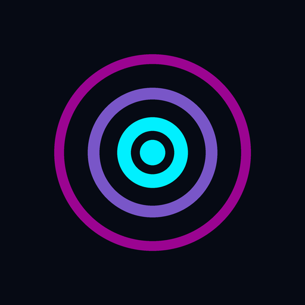
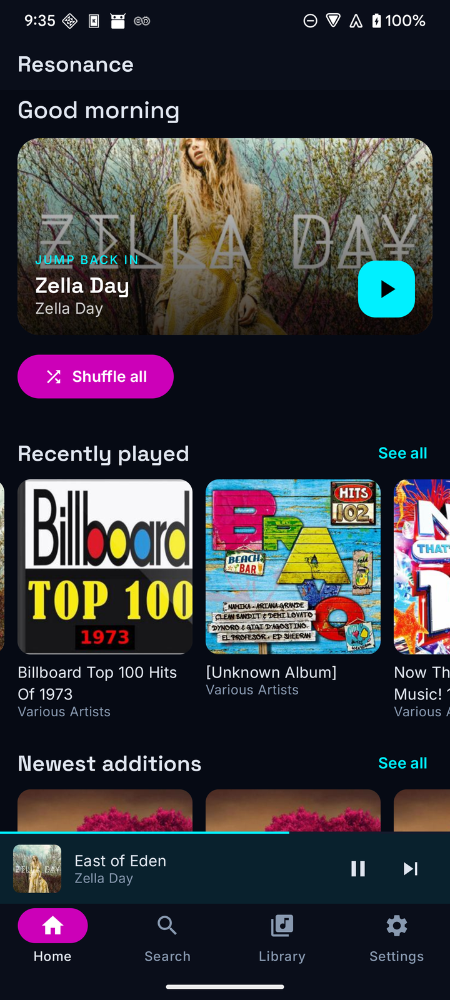
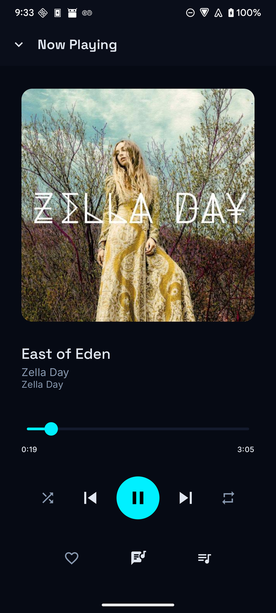
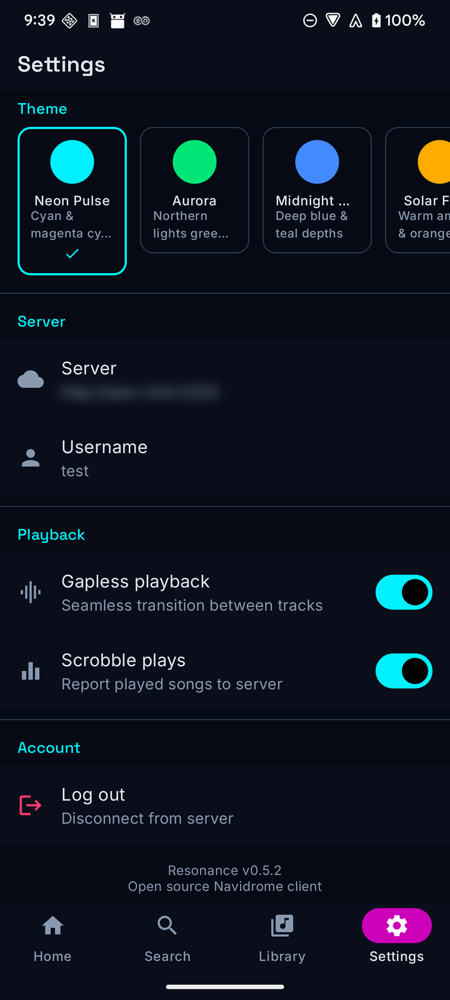

<div align="center">



# Resonance

An open-source Android client for [Navidrome](https://www.navidrome.org/) and other [Subsonic](http://www.subsonic.org/)-compatible music servers.

[](https://github.com/AlanHuang99/resonance/actions/workflows/build.yml)
[](LICENSE)
[](https://github.com/AlanHuang99/resonance/releases/latest)

</div>

## Screenshots

<div align="center">

&nbsp;

&nbsp;

</div>

## Features

- Stream your library from any Subsonic or Navidrome server
- Browse by artist, album, and genre, and search across the library
- Playback controls: play, pause, skip, seek, shuffle, repeat, and a queue
- Background playback with media-session and notification controls
- Mini-player plus a full-screen player with swipe gestures
- Favorites: star artists, albums, and songs
- Artist pages with a biography and similar artists
- Synced and plain-text lyrics with auto-scroll
- Scrobbling: report played tracks back to the server
- Several color themes
- No ads and no tracking; the only account is your own server

## Requirements

- A Subsonic-compatible server, such as [Navidrome](https://www.navidrome.org/)
- Android 12 (API 31) or newer

## Install

Download the latest APK from the [Releases](https://github.com/AlanHuang99/resonance/releases/latest) page and install it on your device.

Publishing on [F-Droid](https://f-droid.org/) is planned.

## Build from source

You need:

- JDK 17
- The Android SDK with platform API 34 and build-tools (installing [Android Studio](https://developer.android.com/studio) is the simplest way to get these)

Then:

```bash
git clone https://github.com/AlanHuang99/resonance.git
cd resonance
./gradlew assembleDebug
```

The APK is written to `app/build/outputs/apk/debug/app-debug.apk`. To build and install straight to a connected device, use `./gradlew installDebug` instead.

`./gradlew assembleRelease` produces a release APK and works without any signing secrets; the result is unsigned unless signing material is provided.

## Tech stack

| Layer | Technology |
|-------|-----------|
| UI | Jetpack Compose, Material 3 |
| Architecture | MVVM, Hilt |
| Playback | Media3 / ExoPlayer |
| Networking | Retrofit, OkHttp, Gson |
| Images | Coil |
| Preferences | DataStore |
| Async | Kotlin Coroutines and Flow |

## Server compatibility

- [Navidrome](https://www.navidrome.org/)
- Any server implementing the [Subsonic API](http://www.subsonic.org/pages/api.jsp)

## Contributing

Issues and pull requests are welcome. For anything substantial, please open an issue first so we can discuss the approach.

## License

Resonance is licensed under the GNU General Public License v3.0. See the [LICENSE](LICENSE) file for the full text.
